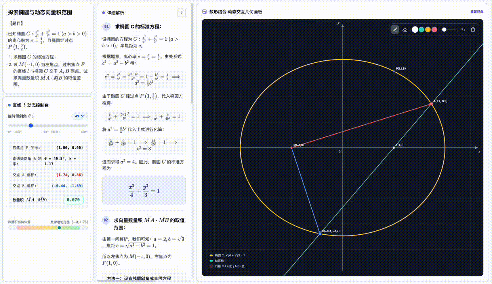

# edulab

[简体中文](README.zh-CN.md) · **English**

A collection of education skills that turn academic problems into **interactive lesson web pages**.

## Install

**Recommended** — install with [skills](https://github.com/vercel-labs/skills) in one command:

```bash
npx skills add wy51ai/edulab
```

To update to the latest version later:

```bash
npx skills update
```

Or use it as a Claude Code plugin marketplace:

```
/plugin marketplace add wy51ai/edulab
/plugin install edulab
```

Once installed, the skills activate on their trigger words, and can also be invoked manually.

## Skill: edu-solid-geometry


Solves one solid geometry problem into a self-contained interactive lesson page. Three entry points:

| Entry point | What it does |
|---|---|
| Text problem | Extracts the statement and solves directly |
| Image upload | Reads the problem from the image via vision, echoes it back for confirmation, then solves |
| Random problem | Solves with random parameters; re-rolls if the answer isn't clean |

**Problem types covered**: line-plane angle, dihedral angle, angle between skew lines, point-to-plane distance, volume, and more — on cubes / cuboids, pyramids / prisms, cylinders / cones. All solved uniformly via the "coordinate system + vector method."

**Trigger words**: solid geometry, line-plane angle, dihedral angle, angle between skew lines, distance to plane, interactive geometry solution page; 立体几何、线面角、二面角、异面直线、点到平面距离、正四棱锥、解这道几何题、随机出一道立体几何题、这张图里的立体几何题, etc.

### Dependency

The compute core `lib/geometry_kernel.py` depends on **sympy**. Use any `python3` that can import sympy:

```bash
python3 -m pip install sympy   # if sympy is missing
```

### Generate from the command line (without Claude)

```bash
cd skills/edu-solid-geometry
python3 scripts/generate.py cube   ./cube.html     # cube · line-plane angle
python3 scripts/generate.py box    ./box.html      # cuboid · volume
python3 scripts/generate.py random 7 ./random.html # random problem (seed=7)
python3 lib/geometry_kernel.py                     # kernel built-in self-check
```

> If you don't pass an output path, it writes to the **current working directory (cwd)**.

## Skill: edu-analytic-geometry



Solves one analytic geometry (conic sections) problem into a self-contained interactive lesson page. Same three entry points as above (text / image / random). Built on a **2D Canvas board + KaTeX** with a generic, data-driven interactive engine: a parameter slider drives derived constructions (line∩conic, point-on-conic, central reflection, tangent…) and live readouts, with a theoretical-range bar or a fixed-value indicator.

**Problem types covered**: standard equation, chord length, dot-product range / fixed value, triangle-area extremum, fixed point, fixed value (slope product), locus, tangent, eccentricity — on ellipses / hyperbolas / parabolas / circles. All solved uniformly via "parametrized line `x = my + c` + system + Vieta's formulas + substitution."

> A correctness note baked into the kernel: open/closed interval endpoints are decided by whether a *real* line attains them, so the boxed answer always matches what the interactive tool shows (e.g. the ellipse `MA·MB` range is the **closed** `[-3, 7/4]` — slide θ to 0° and you read exactly −3).

**Trigger words**: analytic geometry, conic sections, ellipse, hyperbola, parabola, chord length, dot product range, fixed point, fixed value, locus, eccentricity, interactive analytic geometry solution page; 解析几何、圆锥曲线、椭圆、双曲线、抛物线、焦点弦、向量数量积取值范围、定点问题、定值问题、斜率之积、三角形面积最值、轨迹方程、离心率, etc.

### Dependency

The compute core `lib/analytic_kernel.py` depends on **sympy** (same as above).

### Generate from the command line (without Claude)

```bash
cd skills/edu-analytic-geometry
python3 scripts/generate.py list                          # list registered problem types
python3 scripts/generate.py ellipse_dot_range ./sol.html  # ellipse · MA·MB range [-3, 7/4]
python3 scripts/generate.py parabola_dot_const ./sol.html # parabola focal chord · OA·OB ≡ -3
python3 scripts/generate.py all ./out_dir                 # all registered types
python3 lib/analytic_kernel.py                            # kernel built-in self-check
```

> Like above, no output path → writes to the **current working directory (cwd)**.

## How it works

1. **Get a problem spec** — normalize all three entry points into a structured description (body type and dimensions, given conditions, the quantity asked, language).
2. **Exact kernel computation** — sympy computes exact coordinates, key vectors, normals, the final answer, and every intermediate value (as LaTeX strings). Never by hand.
3. **Assemble and inject the template** — feed the `lesson` / `steps` / `model` data into the data-driven template `template/lesson.html`; 3D vertex coordinates come from `kernel.to_three(...)`, sharing the same source as the solution.
4. **Self-check** — kernel answer == answer card == final value shown in the last step; a local static server + preview check confirms no console errors and correct formula/highlight rendering.
5. **Deliver** — the finished page is written to the user's current working directory, named like `solution-<short-description>.html`.

## Project structure

```
edulab/
├── .claude-plugin/
│   ├── plugin.json              # plugin metadata
│   └── marketplace.json         # marketplace manifest
├── index.html                   # finished sample (quad pyramid · line-plane angle)
└── skills/
    ├── edu-solid-geometry/      # solid geometry — 3D (Three.js) + MathJax
    │   ├── SKILL.md
    │   ├── template/lesson.html # data-driven template (generic 3D renderer + data island)
    │   ├── lib/
    │   │   ├── geometry_kernel.py  # sympy exact-computation core
    │   │   └── bodies.py           # edge-topology library for solids
    │   ├── scripts/generate.py
    │   ├── output/
    │   └── references/          # problem-schema.md · conventions.md
    └── edu-analytic-geometry/   # analytic geometry / conics — 2D (Canvas) + KaTeX
        ├── SKILL.md
        ├── template/board.html  # data-driven template (generic 2D renderer + param engine)
        ├── lib/
        │   ├── analytic_kernel.py  # sympy exact-solver core (system · Vieta · range · fixed value)
        │   └── conics.py           # conic-section definition library
        ├── scripts/generate.py
        ├── output/
        └── references/          # problem-schema.md · conventions.md
```

## Extending

**edu-solid-geometry**
- **Add a problem type**: add a solver function in `geometry_kernel.py` (see the recipe table in `references/conventions.md`), then add a `build_*` in `generate.py`.
- **Add a solid**: add a coordinate-construction function in `geometry_kernel.py`, then add its edge topology in `bodies.py`.

**edu-analytic-geometry**
- **Add a problem type**: add a target-quantity function in `analytic_kernel.py` and reuse `range_over_m` / `is_constant_in_m`, then add a `build_*` in `generate.py` (pick an interaction: range bar / fixed value / fixed point / locus trace).
- **Add a curve**: ellipse / hyperbola / parabola / circle are built in; new curves go in `conics.py` and the `board.html` engine.

## License

[Apache-2.0](LICENSE)

## Author

WY · [@akokoi1](https://x.com/akokoi1)

## Star History

<a href="https://www.star-history.com/?repos=wy51ai%2Fedulab&type=date&legend=top-left">
 <picture>
   <source media="(prefers-color-scheme: dark)" srcset="https://api.star-history.com/chart?repos=wy51ai/edulab&type=date&theme=dark&legend=top-left" />
   <source media="(prefers-color-scheme: light)" srcset="https://api.star-history.com/chart?repos=wy51ai/edulab&type=date&legend=top-left" />
   
 </picture>
</a>
