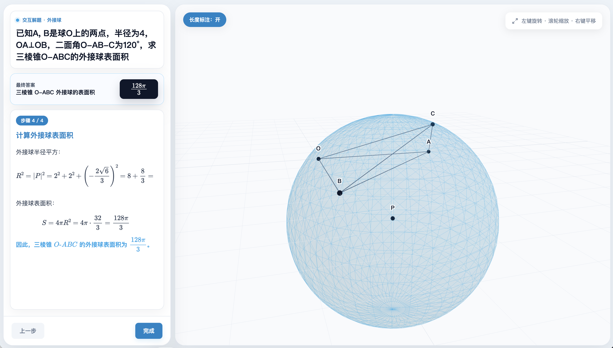

# edulab

**简体中文** · [English](README.md)

教育类技能集合：把学科问题转成**可交互的教学网页**。

edulab 是一个 [Claude Code](https://claude.com/claude-code) 插件（plugin + marketplace）。它的目标是：给一道题，产出一个能直接用浏览器打开、自带讲解和可视化的单页 HTML，让"看懂"变成"能动手转一转看明白"。

原有技能 **edu-solid-geometry** 负责立体几何解题：用"建系 + 向量法"求解，由 [sympy](https://www.sympy.org) 精确计算驱动，输出左侧分步解析（MathJax）+ 右侧可交互 3D 模型（Three.js）的教学网页。

新增技能 **edu-higher-math** 把同样的"精确计算 + 交互教学页"模式扩展到高等数学：二重积分、极坐标积分、曲面积分/通量、一阶常微分方程。输出 MathJax 分步解析 + SVG 交互图示（积分区域、曲面/向量场、斜率场）。

新增技能 **edu-signals-control** 面向信号与控制入门反馈题：单环负反馈、闭环传递函数、高环路增益极限，例如 `H(s)=kA/(1+kAF(s)) -> 1/F(s)`。输出反馈框图、环路增益滑块和幅相采样图示。

## 效果预览



根目录的 [index.html](index.html) 是一个成品样例（正四棱锥·线面角），直接用浏览器打开即可查看：

- **左侧**：题面 / 答案 / 分步解析，公式用 MathJax 渲染
- **右侧**：题目对应的 3D 模型，可旋转缩放，分步高亮关键元素并切换镜头
- 答案、3D 坐标、每步中间数值**同源一致**（都来自同一份 sympy 计算）

更多样例可用下面的 CLI 命令生成。

## 安装

**推荐** —— 用 [skills](https://github.com/vercel-labs/skills) 一行命令安装：

```bash
npx skills add wy51ai/edulab
```

后续更新到最新版：

```bash
npx skills update
```

或作为 Claude Code 插件市场使用：

```
/plugin marketplace add wy51ai/edulab
/plugin install edulab
```

安装后，技能会随触发词自动激活，也可被其他 agent 调用来生成这类网页。

## 技能列表

| 技能 | 重点 | 图示 |
|---|---|---|
| `edu-solid-geometry` | 立体几何，建系 + 向量法 | Three.js 3D 模型，分步高亮 |
| `edu-higher-math` | 二重积分、曲面积分/通量、一阶微分方程 | SVG 积分区域、曲面/向量场、斜率场 |
| `edu-signals-control` | 负反馈传递函数、高环路增益极限 | SVG 反馈框图、环路增益滑块、幅相采样 |

## 技能：edu-solid-geometry

把一道立体几何题解成一个自包含的交互教学网页。支持三种入口：

| 入口 | 说明 |
|---|---|
| 文字题目 | 直接抽取题面求解 |
| 上传图片 | 视觉读图识别题目，回显确认后求解 |
| 随机出题 | 随机参数求解，答案不规整自动重抽 |

**覆盖题型**：正方体 / 长方体、棱锥 / 棱柱、圆柱 / 圆锥上的——线面角、二面角、异面直线夹角、点到平面距离、体积等。统一用"建系 + 向量法"。

**触发词**：立体几何、线面角、二面角、异面直线、点到平面距离、正四棱锥、解这道几何题、随机出一道立体几何题、这张图里的立体几何题；solid geometry, line-plane angle, dihedral angle, distance to plane, interactive geometry solution page 等。

### 依赖

计算核心 `lib/geometry_kernel.py` 依赖 **sympy**。用任意一个能 import sympy 的 `python3` 即可：

```bash
python3 -m pip install sympy   # 若缺 sympy
```

### 命令行直接生成（不经过 Claude）

```bash
cd skills/edu-solid-geometry
python3 scripts/generate.py cube   ./cube.html     # 正方体·线面角
python3 scripts/generate.py box    ./box.html      # 长方体·体积
python3 scripts/generate.py random 7 ./random.html # 随机出题（seed=7）
python3 lib/geometry_kernel.py                     # kernel 内置样例自检
```

> 不传输出路径时，默认写到**当前工作目录（cwd）**。

## 技能：edu-higher-math

把一道高等数学题解成一个自包含的交互教学网页。首版覆盖：

| 主题 | 精确求解 | 图示 |
|---|---|---|
| 二重积分 | 直角坐标矩形区域、极坐标积分与雅可比因子 | 区域采样与累积结果 |
| 曲面积分 / 通量 | 参数曲面通量 `F(r(u,v)) · (r_u x r_v)` | 曲面网格、向量场、有向法向量 |
| 一阶微分方程 | SymPy `dsolve` 解初值问题 | 斜率场 + 精确解曲线 |

**触发词**：高等数学、二重积分、极坐标积分、曲面积分、通量、微分方程、斜率场、解这道高数题；higher math, calculus, double integral, surface integral, flux, ODE 等。

### 命令行直接生成

```bash
cd skills/edu-higher-math
python3 scripts/generate.py double-integral ./double-integral.html
python3 scripts/generate.py polar-integral ./polar-integral.html
python3 scripts/generate.py surface-flux ./surface-flux.html
python3 scripts/generate.py ode ./ode.html
python3 scripts/generate.py random 7 ./higher-math-random.html
python3 lib/calculus_kernel.py
```

首版不承诺任意 OCR 读题、覆盖所有高数题型、PDE、闭曲面定理自动选择，或"任何微分方程都能解"。

## 技能：edu-signals-control

把一道信号与控制反馈题解成一个自包含的交互教学网页。首版覆盖：

| 主题 | 精确求解 | 图示 |
|---|---|---|
| 单环负反馈 | `H(s)=G(s)/(1+G(s)B(s))` | 可高亮信号路径的反馈框图 |
| 高环路增益极限 | `k -> infinity` 这类符号极限 | 环路增益滑块展示 `1/(kA)` 项变小 |
| 一阶反馈网络 | 例如 `F(s)=1/(tau*s+1)` | 闭环响应与高增益近似的幅值采样 |

**触发词**：信号与系统、自动控制、反馈框图、闭环传递函数、传递函数、拉普拉斯域、k趋于无穷、运放负反馈；signals and systems, control systems, feedback block diagram, transfer function, high loop gain, Bode sample 等。

### 命令行直接生成

```bash
cd skills/edu-signals-control
python3 scripts/generate.py feedback-limit ./feedback-limit.html
python3 scripts/generate.py first-order-feedback ./first-order-feedback.html
python3 scripts/generate.py random 7 ./signals-control-random.html
python3 lib/control_kernel.py
```

首版不承诺任意框图自动化简、MIMO 系统、非线性系统、根轨迹设计、控制器整定或稳定性证明自动化。

## 工作原理

1. **得到 problem spec** —— 把文字 / 图片 / 随机入口归一成结构化数据（主题、已知条件、所求、语言）。
2. **kernel 精确计算** —— SymPy 算出精确坐标、向量、积分、通量、微分方程解、传递函数或反馈极限，绝不心算。
3. **组装并注入模板** —— 把 `lesson` / `steps` / `model` 或 `visual` 数据注入对应技能的 HTML 模板；图示采样与答案同源。
4. **自检** —— kernel 答案 == 答案卡 == 末步骤展示值；本地静态服务 + 预览检查无报错、公式与高亮正常。
5. **交付** —— 成品写到用户当前工作目录，命名形如 `solution-<题目简述>.html`。

## 目录结构

```
edulab/
├── .claude-plugin/
│   ├── plugin.json              # 插件元信息
│   └── marketplace.json         # 市场清单
├── index.html                   # 成品样例（正四棱锥·线面角）
└── skills/
    ├── edu-solid-geometry/
    │   ├── SKILL.md             # 技能说明与工作流程
    │   ├── template/lesson.html # 数据驱动模板（通用 3D 渲染器 + 数据岛）
    │   ├── lib/
    │   │   ├── geometry_kernel.py  # sympy 精确计算核心
    │   │   └── bodies.py           # 几何体棱拓扑库
    │   ├── scripts/generate.py  # 注入模板 + 范例构建函数
    │   └── references/
    │       ├── problem-schema.md   # 数据格式
    │       └── conventions.md      # 建系约定、解法配方、自检
    ├── edu-higher-math/
        ├── SKILL.md
        ├── template/lesson.html
        ├── lib/calculus_kernel.py
        ├── scripts/generate.py
        └── references/
            ├── problem-schema.md
            └── conventions.md
    └── edu-signals-control/
        ├── SKILL.md
        ├── template/lesson.html
        ├── lib/control_kernel.py
        ├── scripts/generate.py
        └── references/
            ├── problem-schema.md
            └── conventions.md
```

## 扩展

- **加题型**：在 `geometry_kernel.py` 加求解函数（见 `references/conventions.md` 配方表），在 `generate.py` 加一个 `build_*`。
- **加几何体**：在 `geometry_kernel.py` 加坐标构建函数，在 `bodies.py` 加棱拓扑。
- **加高数主题**：在 `calculus_kernel.py` 增加精确求解与采样函数，再在 `skills/edu-higher-math/scripts/generate.py` 注册 builder。
- **加信号/控制主题**：在 `control_kernel.py` 增加精确传递函数求解与采样函数，再在 `skills/edu-signals-control/scripts/generate.py` 注册 builder。

## License

[Apache-2.0](LICENSE)

## 作者

WY · [@akokoi1](https://x.com/akokoi1)

欢迎 star、issue、PR。
