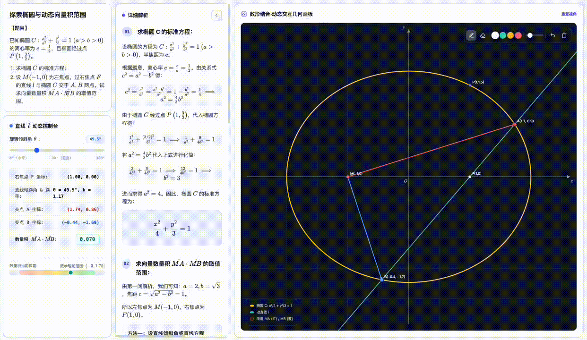

# edulab

**简体中文** · [English](README.md)

教育类技能集合：把学科问题转成**可交互的教学网页**和**带配音的讲解视频**。

## 安装

**推荐** —— 用 [skills](https://github.com/vercel-labs/skills) 一行命令安装：

```bash
npx skills add wy51ai/edulab
```

后续更新到最新版：

```bash
npx skills update
```

> **注意**：`npx skills update` 只会把**已安装**的技能刷新到最新版，**不会**自动拉取仓库新增的技能。当本仓库新增了技能（如新的 `edu-*`）时，再次运行 `npx skills add wy51ai/edulab` 即可装上。

或作为 Claude Code 插件市场使用：

```
/plugin marketplace add wy51ai/edulab
/plugin install edulab
```

安装后，技能会随触发词自动激活，也可以手动调用。

## 技能：edu-solid-geometry


把一道立体几何题解成一个自包含的交互教学网页。支持三种入口：

| 入口 | 说明 |
|---|---|
| 文字题目 | 直接抽取题面求解 |
| 上传图片 | 视觉读图识别题目，回显确认后求解 |
| 随机出题 | 随机参数求解，答案不规整自动重抽 |

**覆盖题型**：正方体 / 长方体、棱锥 / 棱柱、圆柱 / 圆锥上的——线面角、二面角、异面直线夹角、点到平面距离、体积等。统一用"建系 + 向量法"。

**触发词**：立体几何、线面角、二面角、异面直线、点到平面距离、正四棱锥、解这道几何题、随机出一道立体几何题、这张图里的立体几何题；solid geometry, line-plane angle, dihedral angle, distance to plane, interactive geometry solution page 等。

### 依赖

计算核心 `lib/geometry_kernel.py` 依赖 **sympy**。用任意一个能 import sympy 的 `python3` 即可：

```bash
python3 -m pip install sympy   # 若缺 sympy
```

### 命令行直接生成（不经过 Claude）

```bash
cd skills/edu-solid-geometry
python3 scripts/generate.py cube   ./cube.html     # 正方体·线面角
python3 scripts/generate.py box    ./box.html      # 长方体·体积
python3 scripts/generate.py random 7 ./random.html # 随机出题（seed=7）
python3 lib/geometry_kernel.py                     # kernel 内置样例自检
```

> 不传输出路径时，默认写到**当前工作目录（cwd）**。

## 技能：edu-analytic-geometry



把一道解析几何（圆锥曲线）题解成一个自包含的交互教学网页。三入口与上面一致（文字 / 图片 / 随机）。基于 **2D Canvas 画板 + KaTeX** 的通用数据驱动交互引擎：一个参数滑块驱动派生构造（直线∩曲线、曲线上动点、中心对称、切线…）与实时读数，并配理论范围条或定值指示。

**覆盖题型**：求标准方程、弦长、向量数量积取值范围 / 定值、三角形面积最值、定点、定值（斜率之积）、轨迹、切线、离心率——涵盖椭圆 / 双曲线 / 抛物线 / 圆。统一用"设含参直线 `x=my+c` + 联立 + 韦达 + 换元"。

> kernel 内置的一个正确性细节：区间端点的开 / 闭由"是否有真实直线取到"判定，所以框出的答案始终与交互工具一致（例如椭圆 `MA·MB` 的范围是**闭区间** `[-3, 7/4]`——把 θ 拖到 0° 屏幕上正好读到 −3）。

**触发词**：解析几何、圆锥曲线、椭圆、双曲线、抛物线、焦点弦、向量数量积取值范围、定点问题、定值问题、斜率之积、三角形面积最值、轨迹方程、离心率；analytic geometry, conic sections, ellipse, hyperbola, parabola, chord length, dot product range, fixed point, locus, interactive analytic geometry solution page 等。

### 依赖

计算核心 `lib/analytic_kernel.py` 依赖 **sympy**（同上）。

### 命令行直接生成（不经过 Claude）

```bash
cd skills/edu-analytic-geometry
python3 scripts/generate.py list                          # 列出已注册题型
python3 scripts/generate.py ellipse_dot_range ./sol.html  # 椭圆 · MA·MB 范围 [-3, 7/4]
python3 scripts/generate.py parabola_dot_const ./sol.html # 抛物线焦点弦 · OA·OB ≡ -3
python3 scripts/generate.py all ./out_dir                 # 全部已注册题型
python3 lib/analytic_kernel.py                            # kernel 内置自检
```

> 同上，不传输出路径时默认写到**当前工作目录（cwd）**。

## 技能：edu-chem-reaction


把一个化学反应做成自包含的**微观 3D 演示**网页：一侧是可交互的 Three.js 分子动画（拖滑块看化学键断裂 / 生成、原子重新组合，分步高亮），另一侧是 KaTeX 反应方程 + 分步讲解 + 原子守恒计数 + 可选能量-反应进程曲线。三入口与上面一致（文字 / 图片 / 随机）。

**双引擎自动选择** —— 一套渲染器、两种逐帧定位，共用键差绘制、标签、叠加层与 UI：

| 引擎 | 适用 | 强调 |
|---|---|---|
| morph | 燃烧、化合 / 分解 / 置换、氧化还原 | 原子各自飞向新搭档——原子守恒与重组 |
| mechanism | 有机机理（酯化…），含催化剂 · 过渡态 · 离去基团 | 分子片段按关键帧刚体位移——反应机理 |

**sympy 驱动的正确性**：自动配平方程（由元素矩阵零空间求整数计量数）、校验原子映射（反应物↔产物原子的双射）与守恒，并由反应前后键的差集推导哪根键断 / 成——方程、几何、计数器同源一致。

**混合几何**：默认用自建 VSEPR 分子库；若环境装有 RDKit 则可由 SMILES 生成构象（绝不自动安装）。

**覆盖反应**：甲烷 / 氢气燃烧、电解水、钠与氯气氧化还原（含电子转移叠加层）、葡萄糖有氧氧化、酯化机理——涵盖初中基础、高中无机氧化还原与有机机理。

**触发词**：化学反应、微观演示、分子动画、燃烧、电解水、氧化还原、电子转移、酯化反应、断键成键、原子守恒、化学方程式配平；chemistry reaction, microscopic/molecular animation, combustion, electrolysis, redox electron transfer, esterification mechanism, atom conservation, interactive chemistry reaction page 等。

### 依赖

计算核心 `lib/reaction_kernel.py` 依赖 **sympy**（同上）。**RDKit 为可选项**——装了才用，绝不自动安装。

### 命令行直接生成（不经过 Claude）

```bash
cd skills/edu-chem-reaction
python3 scripts/generate.py list                            # 列出已注册反应
python3 scripts/generate.py combustion_ch4 ./reaction.html  # 甲烷燃烧（morph · 火焰）
python3 scripts/generate.py esterification ./reaction.html  # 酯化反应（mechanism · 催化剂）
python3 scripts/generate.py random 7 ./random.html          # 随机出题（seed=7）
python3 lib/reaction_kernel.py                              # kernel 内置自检
```

> 同上，不传输出路径时默认写到**当前工作目录（cwd）**。

## 技能：edu-math-video


把数学题（几何、代数、函数、行程问题……）和适用的生物机制做成 **16:9、1920×1080 的讲解视频 MP4**：中文配音、中英双语字幕（同时输出 `.srt`）、按旁白时间轴驱动的 Canvas 动画。可用 GLM-TTS 或受支持的兜底引擎，包括 Windows 免费离线中文配音。输入可以是题目截图或文字；生物示例也可作为概念微课。

**图会"讲题"**：每句旁白在图上都有一个"指 → 动 → 留"的动作（相等线段滑过去重合、全等三角形叠上去、3D 相机转到俯视、圆锥侧面展开成扇形……），用 `S.at(k, f)`（第 k 句开始后 f 比例处）定时，绝不写死秒数；`motion` 检查会标出非豁免场景中的静止片段。

**流水线**（每个视频一个文件夹，建在用户当前目录）：

```
script.json ──build_audio.py──► timeline.json + mix.wav + <name>.srt   （GLM-TTS + 合成音乐）
anim.js + engine.js ──node render.mjs video──► <name>.mp4              （Playwright + ffmpeg，30 fps）
```

**护栏**：开头给出看得见的问题，使用原题条件前先讲清依据；`tts` 字段只能是能念出来的中文（无数字/数学符号）；多音字必须固定读音（`长[cháng]`，共享 `pron.json` 词表），`--check` 为 0 才允许调用付费 TTS。先免费 `--preview` + 截图拼图审查，再生成真配音。可选 `--asr` 使用在线识别，发送配音前必须获得授权；离线课程可跳过并说明实际验证范围。

**触发词**：讲解视频、解题视频、例题精讲、数学题视频、生物微课、细胞动画；math explainer video、biology explainer video、cell animation 等。技能名保持 `edu-math-video`。

### 依赖

- Python 3 + `numpy requests pypinyin pillow`；Node.js 18+ + `playwright` + `ffmpeg-static`（在工作目录装一次，`scripts/new_video.sh` 会生成 `package.json`）；Google Chrome 或 Playwright Chromium。
- 可选智谱 **`GLM_API_KEY`**，由你自己提供，写在 `~/.config/math-problem-video/.env`（见 `reference/glm-tts-setup.md`）。
- **没有 key？** 自动兜底（`TTS_ENGINE=auto`）：装了 [edge-tts](https://github.com/rany2/edge-tts) 就用它（免费神经网络音色，需联网），否则用 macOS 自带的 `say`（离线，机械感明显）。Windows 已安装中文桌面语音时优先使用系统离线配音，再考虑 Edge。也可用 `TTS_ENGINE=glm|windows|edge|say` 指定。

### 手动跑流水线（不经过 Claude）

```bash
bash skills/edu-math-video/scripts/new_video.sh "$PWD" my_problem   # 从 template/ 建项目
bash skills/edu-math-video/scripts/setup_check.sh my_problem        # 必须输出 ALL OK
cd my_problem
python3 build_audio.py --check                                      # 脚本 + 读音检查（免费）
python3 build_audio.py --preview && node render.mjs motion && node render.mjs stills auto
python3 build_audio.py && node render.mjs video 6                   # 真配音，然后渲染（6 = 并行页数）
```

### 视频教学升级（0.2.0）

- `pause_after` 为关键问题留思考时间，视频和 SRT 都保留问题字幕。
- `theorem` 声明定理条件、依据和结论，`--check` 生成教学检查报告；它检查结构，不能代替数学验算。
- Windows 支持免费系统离线中文配音，增加 PowerShell 建项目入口与跨平台环境检查。
- 运动指标在浏览器内计算，直接导出 Canvas 帧；音频平滑改为线性算法，减少渲染与混音等待。
- 示例增加定理条件核对和迁移题；不含新字段的旧脚本时序不变。

详见 [教学质量指南](skills/edu-math-video/reference/teaching-quality.md)。Windows 使用完整技能路径运行 `SKILL/scripts/new_video.ps1 -Workspace $PWD -Name my_problem`，然后用 `python SKILL/scripts/setup_check.py my_problem` 检查环境；工作目录仍使用用户指定的目录。

### 细胞机制课程（0.3.0）


- 可复用的 [Canvas 细胞模型](skills/edu-math-video/lib/biology-model.js) 保持同一个细胞、线粒体与溶酶体，镜头从整体进入局部机制，再回到整体。
- 约一分钟的 [mitophagy-cell 示例](skills/edu-math-video/examples/mitophagy-cell/) 以“坏掉的线粒体，细胞怎样清理？”开场，演出包裹、闭合、融合和内部降解，结尾给出迁移问题。一句旁白解释一个看得见的变化。
- 可选 `episode.motion_regions` 让动作检查覆盖实际模型区域，不再默认所有图形都在左半屏。可选 `music_level` 是 `0` 到 `1` 的数字，默认 `1`；`0` 关闭背景音乐，保留旁白和已配置音效。旧数学项目沿用默认行为。
- 先审阅 45～60 秒样片再导出完整课程。结构和颗粒数量是教学示意，不能当作实验测量；活性氧含量不能改称存活率。项目不承诺流量或学习提升幅度。

在自己的课程目录创建独立示例（替换下面路径）：

```bash
python /path/to/edu-math-video/scripts/create_biology_demo.py --workspace /path/to/lessons --name cell-classroom-demo
cd /path/to/lessons/cell-classroom-demo
python build_audio.py --check
python build_audio.py --preview
node render.mjs motion
node render.mjs stills auto
# 查看截图后，再生成真实配音和视频：
python build_audio.py
node render.mjs video 6
```

模型差异、机制顺序与视觉因果审查清单见 [生物可视化规范](skills/edu-math-video/reference/biology-visuals.md)。模型是 Canvas 教学剖面示意，不是标本重建或互动课堂。


### 本地生成提速（0.3.1）

Windows 离线配音在一个语音引擎中连续生成多段音频，格式已匹配的 PCM 音频省去 FFmpeg 转换，重复旁白只合成一次。视频默认采用 x264 `fast`，沿用 1080p、30 fps 和 CRF 18；本地输入与成品的内容哈希均一致时，直接复用已完成的 MP4。

一台 Windows 机器上的同一段 60 秒细胞课程，**首次配音加导出从 93 秒降到 71 秒**；内容未变的重复导出约 **0.74 秒**。实测不含编写讲稿的时间，不代表所有机器的耗时。`node render.mjs video 4 --fresh --preset medium` 可强制使用原压缩设置重新生成。缓存范围、实测条件与旧项目升级方法见 [性能说明](skills/edu-math-video/reference/performance.md)。

## 工作原理

交互教学网页采用下面的计算核心与模板流程；视频采用上面的配音与 Canvas 流水线。

1. **得到 problem spec** —— 三入口归一成结构化描述（几何体类型与尺寸、已知条件、所求、语言）。
2. **kernel 精确计算** —— sympy 算出精确坐标、关键向量、法向量、最终答案及各步中间量（LaTeX 字符串），绝不心算。
3. **组装并注入模板** —— 把 `lesson` / `steps` / `model` 数据注入数据驱动模板 `template/lesson.html`，3D 顶点坐标由 `kernel.to_three(...)` 给出，与解题同源。
4. **自检** —— kernel 答案 == 答案卡 == 末步骤展示值；本地静态服务 + 预览检查无报错、公式与高亮正常。
5. **交付** —— 成品写到用户当前工作目录，命名形如 `solution-<题目简述>.html`。

## 目录结构

```
edulab/
├── .claude-plugin/
│   ├── plugin.json              # 插件元信息
│   └── marketplace.json         # 市场清单
├── index.html                   # 成品样例（正四棱锥·线面角）
└── skills/
    ├── edu-solid-geometry/      # 立体几何 — 3D（Three.js）+ MathJax
    │   ├── SKILL.md
    │   ├── template/lesson.html # 数据驱动模板（通用 3D 渲染器 + 数据岛）
    │   ├── lib/
    │   │   ├── geometry_kernel.py  # sympy 精确计算核心
    │   │   └── bodies.py           # 几何体棱拓扑库
    │   ├── scripts/generate.py
    │   ├── output/
    │   └── references/          # problem-schema.md · conventions.md
    ├── edu-analytic-geometry/   # 解析几何 / 圆锥曲线 — 2D（Canvas）+ KaTeX
    │   ├── SKILL.md
    │   ├── template/board.html  # 数据驱动模板（通用 2D 渲染器 + 参数引擎）
    │   ├── lib/
    │   │   ├── analytic_kernel.py  # sympy 精确求解核心（联立·韦达·范围·定值）
    │   │   └── conics.py           # 圆锥曲线定义库
    │   ├── scripts/generate.py
    │   ├── output/
    │   └── references/          # problem-schema.md · conventions.md
    ├── edu-chem-reaction/       # 化学反应 — 3D（Three.js）+ KaTeX
    │   ├── SKILL.md
    │   ├── template/reaction.html # 数据驱动模板（统一渲染器 + 双引擎 + 数据岛）
    │   ├── lib/
    │   │   ├── reaction_kernel.py  # sympy 配平 + 守恒/原子映射校验 + 键差 + 装配
    │   │   └── molecules.py        # VSEPR 分子几何库
    │   ├── scripts/generate.py
    │   ├── output/
    │   └── references/          # problem-schema.md · conventions.md
    └── edu-math-video/          # 数学与生物讲解视频 — 配音 + Canvas → MP4
        ├── SKILL.md
        ├── template/            # 可直接运行的示例项目（engine.js · anim.js · build_audio.py · render.mjs）
        ├── shared/              # pron.py + pron.json —— 共享读音词表
        ├── lib/biology-model.js # 可复用细胞剖面与机制动画
        ├── scripts/             # 建项目 · 生物示例 · 环境检查与截图工具
        ├── examples/cone-parallel/  # 立体几何示例（相机转俯视 · 圆锥展开）
        ├── examples/mitophagy-cell/ # 细胞机制样片（连续镜头 · 内部降解）
        └── reference/           # TTS 配置 · 脚本写法 · 读音 · 画面设计 · 动画 API
```

## 扩展

**edu-solid-geometry**
- **加题型**：在 `geometry_kernel.py` 加求解函数（见 `references/conventions.md` 配方表），在 `generate.py` 加一个 `build_*`。
- **加几何体**：在 `geometry_kernel.py` 加坐标构建函数，在 `bodies.py` 加棱拓扑。

**edu-analytic-geometry**
- **加题型**：在 `analytic_kernel.py` 加目标量函数并复用 `range_over_m` / `is_constant_in_m`，在 `generate.py` 加一个 `build_*`（选交互范式：范围条 / 定值 / 定点 / 轨迹 trace）。
- **加曲线**：椭圆 / 双曲线 / 抛物线 / 圆已内置；新曲线在 `conics.py` 与 `board.html` 引擎各加一份。

**edu-chem-reaction**
- **加反应**：在 `generate.py` 加一个 `build_*`（高层 `species + atom_map`，或低层 `atoms + fragments` 用于机理），注册进 `REGISTRY`。
- **加分子 / 离子**：在 `lib/molecules.py` 加一项（VSEPR 几何 + 显示元数据 + 内部键）。

**edu-math-video**
- **做新题**：不改 `engine.js`；每道题重写 `script.json` / `storyboard.md` / `anim.js`，新图形函数写在 `anim.js` 里。
- **做生物课程**：用 `create_biology_demo.py` 创建示例，复用 `lib/biology-model.js`，按 `reference/biology-visuals.md` 审查结构、位置、机制与证据。
- **修读音**：把词加进 `shared/pron.json`（`words` / `ok`），所有视频共用一份词表。

## License

[Apache-2.0](LICENSE)

## 作者

WY · [@akokoi1](https://x.com/akokoi1)

## Star History

<a href="https://www.star-history.com/?repos=wy51ai%2Fedulab&type=date&legend=top-left">
 <picture>
   <source media="(prefers-color-scheme: dark)" srcset="https://api.star-history.com/chart?repos=wy51ai/edulab&type=date&theme=dark&legend=top-left" />
   <source media="(prefers-color-scheme: light)" srcset="https://api.star-history.com/chart?repos=wy51ai/edulab&type=date&legend=top-left" />
   
 </picture>
</a>

## 开发检查

使用已安装 `numpy requests pypinyin pillow` 的 Python 环境，运行 `npm install`、`npx playwright install chromium`、`npm test`。Windows 多个 Python 并存时，将该环境的 Python 放在 PATH 首位。测试包含旧时序、思考停顿、定理声明、离线试听、FFmpeg 发现、Windows 系统语音、Canvas 字幕保留、动作区域配置与音乐控制；不会调用在线配音或识别服务。自动检查仍须配合画面与科学审阅。

CI 配置模板见 `ci/math-video-tests.yml`；拥有 workflow 写入权限的维护者可复制到 `.github/workflows/` 启用。
