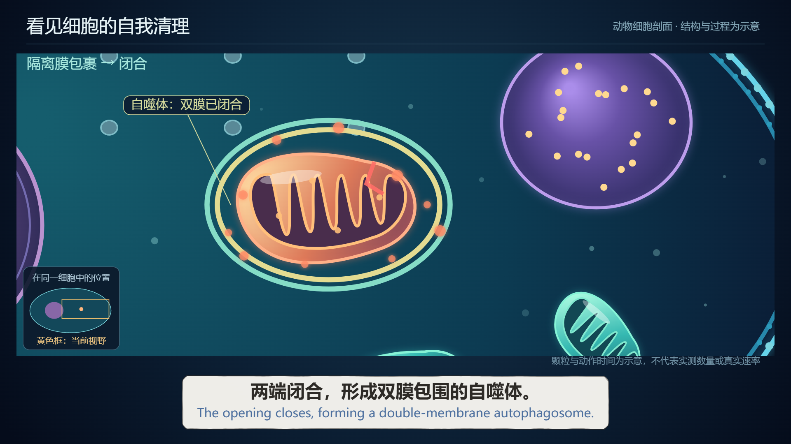

# 进入细胞：线粒体的清理过程

这个短微课用同一个细胞模型连续展示：完整细胞 → 受损线粒体 → 隔离膜包裹 → 自噬体闭合 → 与溶酶体融合 → 降解 → 回到完整细胞。位置小图帮助观众辨认镜头所在位置；模型是教学示意，尺寸和速度不按真实比例。



动画由旁白时间轴驱动，支持直接跳到任意时刻。`episode.json` 的 `motion_regions` 覆盖主舞台，`music_level: 0` 关闭背景音乐，让中文旁白更清楚。模板原有数学视频仍使用原来的布局与默认配置。

## 创建本地项目

在仓库根目录运行，`--workspace` 应指向已存在的工作目录；`--name` 只能是单个ASCII目录名。已经存在的目标会报错，不会覆盖。

```powershell
$skillRoot = Join-Path $PWD 'skills\edu-math-video'
python .\skills\edu-math-video\scripts\create_biology_demo.py --workspace 'D:\Lessons' --name cell-classroom-demo
Set-Location 'D:\Lessons\cell-classroom-demo'
```

macOS/Linux同样使用此Python命令，并替换工作目录路径：

```sh
python3 skills/edu-math-video/scripts/create_biology_demo.py --workspace "$PWD" --name cell-classroom-demo
cd cell-classroom-demo
```

脚手架复制本地模板、示例和 `biology-model.js`，建立 `build/`，并为项目复制独立的 `pron.py`、`pron.json`。示例的多音字修订只写入新项目；用户工作目录和技能的共享词表保持原样。创建步骤不联网、不安装依赖，也不调用配音或语音识别。

## 先检查和预览

选择已经安装 `numpy requests pypinyin pillow` 的Python。渲染需要Node.js 18+、工作目录可找到的 `playwright` 和 `ffmpeg-static`，以及本机Chrome或已安装的Chromium。若FFmpeg在其他位置，可通过 `FFMPEG_BINARY` 指定可执行文件；脚手架不会复制 `node_modules`。

```powershell
$env:PYTHONIOENCODING = 'utf-8'
$env:TTS_ENGINE = 'windows'
python build_audio.py --check
python build_audio.py --preview
node render.mjs motion
node render.mjs stills auto
python (Join-Path $skillRoot 'scripts\contact_sheet.py') .
```

将 `D:\Lessons` 替换为已存在的课程工作目录，保留 `$skillRoot` 指向技能目录。必须先确认读音检查没有未固定读音或脚本错误、运动检查通过，再打开 `build/sheet*.png` 看图。重点核对膜闭合、膜融合和降解的先后顺序；受损线粒体应一直来自同一颗细胞，不应在切镜头时变成另一颗。

## Windows离线中文配音与导出

本机需已安装中文桌面语音。`TTS_ENGINE=windows` 使用Windows系统语音，不调用在线TTS；若无中文语音，先通过系统设置安装相应语音组件。可用 `WINDOWS_VOICE` 选择实际安装的音色，省略时自动选中文音色。

```powershell
$env:TTS_ENGINE = 'windows'
python build_audio.py
node render.mjs motion
node render.mjs stills auto
python (Join-Path $skillRoot 'scripts\contact_sheet.py') .
node render.mjs video 6
```

真实配音时长会改变镜头时间，因此要重新查看截图、试听配音，再导出视频。`6` 是并行渲染页数；内存较少时可改为 `2` 或 `3`。MP4和SRT输出到项目上一级工作目录，文件名由 `episode.json` 的 `output_name` 指定。这条离线流程不运行 `--asr`。

macOS可选择本机 `TTS_ENGINE=say`；其他平台可先完成免费预览。配音引擎与环境配置详见技能的 `reference/glm-tts-setup.md`。

## 改成自己的题目

保留同一个细胞中的位置关系，修改 `script.json`、`storyboard.md` 和 `anim.js` 中的旁白、因果过程和镜头目标。每个镜头的变化用 `S.at(k, f)` 与 `S.P(...)` 绑定当前句子；不要按帧累加细胞器位置。更换旁白后，重复检查、预览和真实时长复查即可。

这个示例说明受损线粒体清除有助于限制活性氧积累。应用到PC12题目时，应将原题柱状图作为实验依据：图2测量的是活性氧含量，不能把它当成直接测量细胞存活率。
